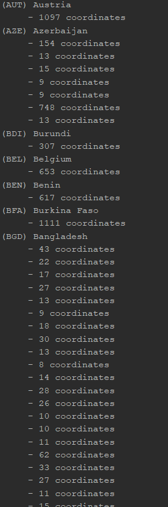
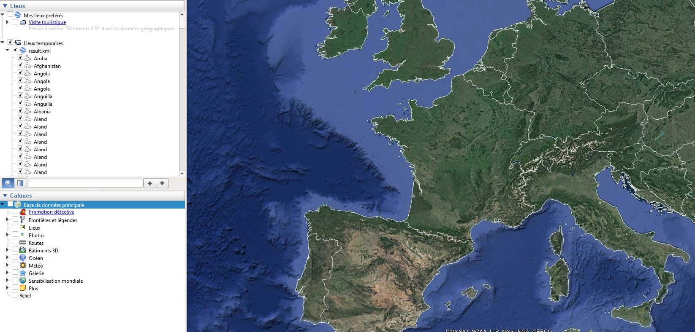

# Rapport SER - Laboratoire 3 : Geojson to KML

Auteurs : Marion Dutu Launay, Luca-Manu Reis De Carvalho, Luc Wachter

Date : 19 mai 2019

## Descriptif des classes Java :

### GeoJSONParser.java

Cette classe contient le parseur qui extrait les informations nécessaires du fichier geojson. Ces informations sont stockées dans des instances de la classe `Country` (expliquée ci-dessous). Elle affiche également la sortie demandée pour la vérification du bon fonctionnement de notre parsing.

### Country.java

Cette classe représente les pays extraits par le parseur. Elle contient tous les éléments qu'il faudra inclure dans le fichier KML généré par la classe KMLBuilder, à savoir le nom du pays, son abrévation et ses coordonnées représentées par une liste de liste d'objets de la classe `Coordinate`. En effet, un pays peut contenir plusieurs zones géographiques qui ne sont pas forcément côte à côte.

### Coordinate.java

Cette classe représente une coordonnée latitude-longitude (x et y).

### KMLBuilder.java

Cette classe contient les méthodes nécessaires à la traduction d'un objet `Country` vers sa notation en langage spécifique KML.

### Application.java

Cette classe représente le main de l'application. Elle crée une instance de `GeoJSONParser` qui parse le fichier geojson et une instance de `KMLBuilder` qui crée le fichier KML demandé.

## Difficultés rencontrées

Au début du laboratoire, nous avons pris du temps à comprendre le format KML et à savoir exactement quelles balises nous devions utiliser.

## Copie d'écran parsing geojson

## Copie d'écran chargement du fichier KML dans Google Earth

## Nos apprentissages

Durant ce laboratoire, nous avons appris comment utiliser le format KML et l'intégrer dans une application comme Google Earth, ce que nous avons trouvé enrichissant. Nous avons aussi découvert un nouveau format de type json, le geojson.

## Conclusion

Pour conclure, nous avons trouvé intéressant de faire une utilisation concrète des formats json et XML. Nous avons pu mettre en pratique nos connaissances acquises pendant le cours de façon ludique.
